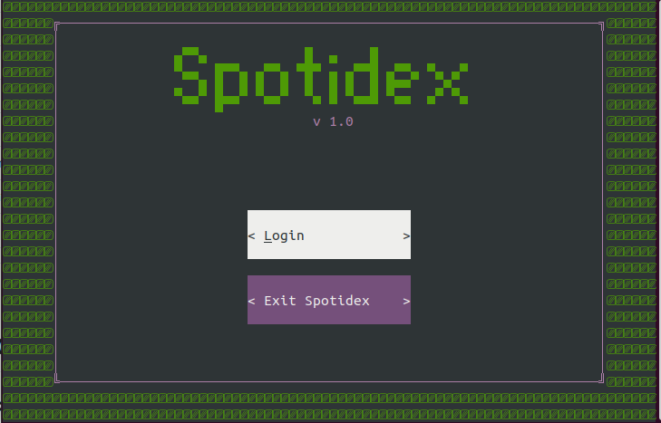
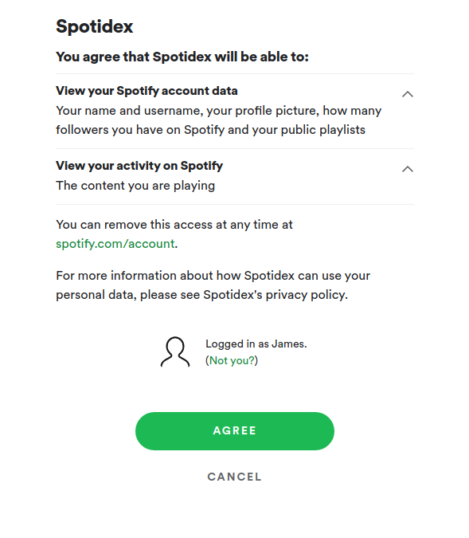
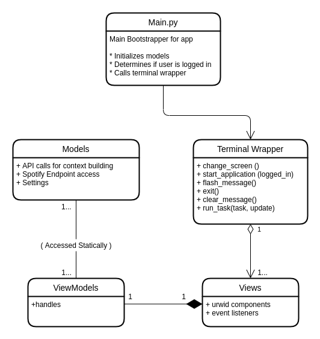
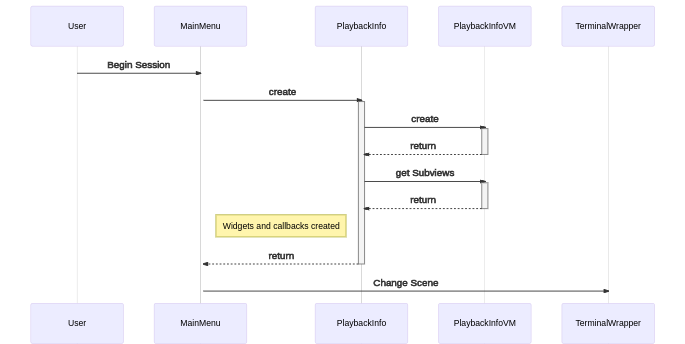
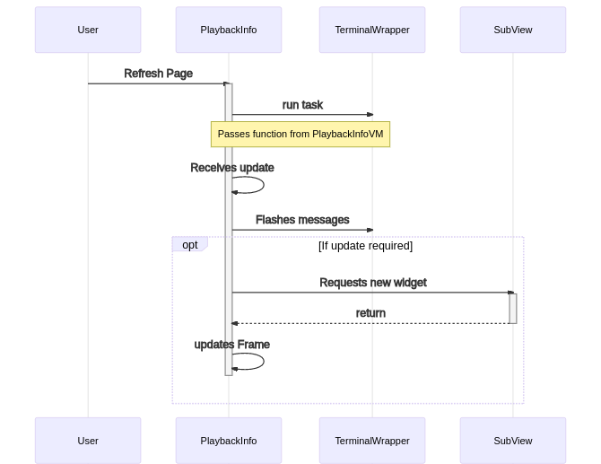
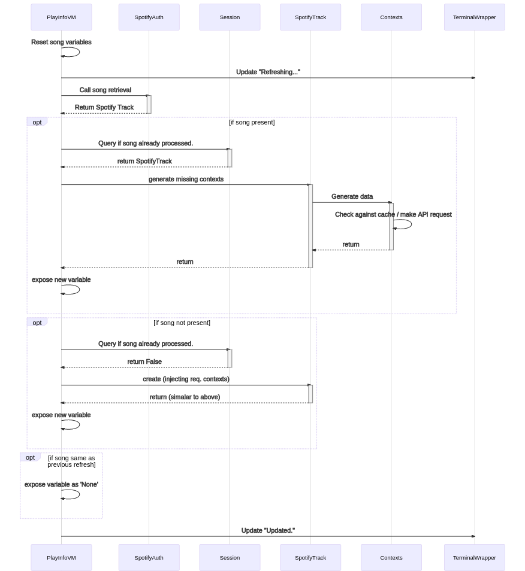

# Spotidex
### A Classical Music Companion for Spotify

This terminal application is designed to run alongside an active Spotify 
session, passively using the Spotify API to gather information about a track
which the user is currently listening to. The app then queries classical music 
APIs in order to deliver a robust context for that track. This is not unlike a 
device in the video game Pokemon (known as a Pokedex) which the protagonist Ash
uses to gain information about creatures he spots in the wild.

Hence... 


## How To Install This Program

> Currently, only the Mac and Linux platforms are supported. There will be a Windows workaround in the future

Please complete the following steps to install Spotidex:

1. Install Python 3.6 or later. Download link [HERE](https://www.python.org/downloads/).
2. Install Pip 3. This should happen by default when installing Python, however if not please follow [these instructions](https://pip.pypa.io/en/stable/installing/).
3. Clone or zip the repository to your local machine.
4. Navigate to the root directory of the project and run the following command:
```shell script
python setup.py install
```
5. run the command `spotidex` from anywhere in your directory to run Spotidex.

## How To Use This Program

### Login Screen

In order to begin a session on Spotidex, you need to allow the program to 
authorize the program to view certain information from your Spotify account:

* Your basic profile information
* Your currently playing information




You'll only have to do this the first time you authorize the app however, as any subsequent launches of the program will bypass this step. Please note though, you will need to reauthorize the app if you log out at any point. 

When you select login, your default browser will open a window where you can login to Spotify. When you do, you should be automatically taken to the main menu. 



> NB: If you close the browser window without cancelling or logging in, you will need to close and reopen the program. This is an issue with a 3rd party module.

### Session Screen

This is the main screen of the program, where you can get a more in-depth view of the piece you're listening to. The program will identify whether the track is a classical music piece and if so will populate the screen with a bunch of interesting information. 


The main components of the screen are:

#### Main View:

This will display the track information in a way more suited for classical music than a normal streaming service would provide. The view will break up the information by movement, work and composer. 

#### Sub-Views:

Clicking on one of the sub-view buttons will provide an extra context about the current track:

* **Spotify:** This lets you see the original track, album and artist info which you would normally see if you were using the Spotify app.
* **Composer:** This will provide the basic information, an ascii art picture, and wikipedia page for the composer of the track that you're listening to.
* **Work:** The wikipedia page for the work you're listening to.
* **Recommended:** A list of popular works by the same composer that you might be interested in checking out.


#### Navigation Controls:

There are several buttons that you can use to navigate Spotidex. Here are their functions:

* **Refresh:** This will query Spotify for the newest track and update any information on the screen if necessary. Spotidex will automatically update the screen every 30 seconds automatically as well.
* **Static:** This will prevent automatic refreshing of the screen.
* **Previous/Next:** This will scan forward and back through the track information for songs previously scanned by Spotidex. This will disarm the automatic refresh function of the page as well.
* **Current:** This will snap Spotidex back to the current song, refresh the screen and re-enable the automatic refresh function.

#### Keyboard Navigation

All the buttons in the main session view can be selected by keyboard shortcuts, designated by the character in the brackets. The mouse events are a little spotty on the Mac OS platform, so I'd highly suggest navigating the program in this way if there are any issues.


## Benchmarks and Criteria

This project is being assessed as part of my assessment for the 2020 Coder 
Academy CCC course. The brief is to design a terminal application that 
handles two-way communication with an API of my choice. This assessment contains
four main criteria that are equally weighted:

1. How well I describe what the app is trying to achieve, how to interact with
it, and how the program achieves it on a high level. In other words, how
thorough this **README** file is. The specific criteria is addressed in the [Development Overview](#development-overview) section.
2. How well I utilize OOP to create the structures needed to deliver the 
solutions for my program, i.e. how well written my model classes are.
3.  How well I utilize OOP to handle input and output of my program, i.e. how 
well written my views and view-models are.
4. How well my programs handles errors and edge cases. My assessors will try to
break my program and it needs to be able to resist those attempts.

In addition, I've taken some time to consider what I wrote in the [previous 
terminal assessment](https://github.com/redbrickhut/StringSectionRosteringUtility), 
and in doing so have come up with some extra benchmarks for myself in order
to demonstrate that I am improving as a developer:

* **Testing**: This project contains rigorous and specific automated tests that 
provide widespread coverage throughout the code base. Given I'm using a lot of
3rd party APIs and modules, there's a need to utilize some considered
strategies in order to accurately expose the code I have written.
* **Project Structure**: This project has a directory structure that attempts
to reflect a real-world distribution as much as possible. It uses the outline
discussed in [this article](https://docs.python-guide.org/writing/structure/)
which outlines an example by Kenneth Reitz.
* **Packages**: As this project is well-structured, this project in turn 
demonstrates an understanding of how package imports are used in Python, and
through that implicitly demonstrates a program that adheres to the MVVM 
(Model / View / View-Model ) structure. This will allow for me to implement a
different interface (such as a GUI) in the future with minimal refactoring. 
* **CI/CD**: This project makes use of Github actions to provide a useful 
automated CI/CD process which as a minimum will be used to ensure the code
pushed to the master branch passes all the required tests. If there is time,
this pipeline will be extended by either deploying the application on Pypi, 
or by creating executable binaries for the major platforms.

## Development Overview

### MVVM Structure

In order to maintain a separation of concerns in this app, I decided upon the MVVM structure. Given that urwid (the GUI terminal emulator I used) has some eccentric properties, it may not adhere exactly to this structure, however for the purposes of this description I'll define it in this way.

Generally speaking there are **_three_** types of components in this app:

* **Models:** These are responsible for the logic and data of the program. Specifically they take care of the authorization, the API calls, rendering the contextual information of the songs, web scraping, caching, and user settings. The models would not change a line of code should the app use a different platform.
* **Views:** These components take care of the visual rendering of the information to the user, changing out the different scenes in the app, and responding to user input. Views have no knowledge of the model components.
* **View-Models:** These are known to the view components, and act as a go-between for the model and view classes. They provide methods (or handles) for the views to call when actions are needed that require complex logic. There is one view-model per view (except for the main menu which is too simple to warrant one).

#### Execution Flow


Whilst the diagram doesn't warrant much explanation there is one topic that warrants further explanation, namely how the view-models 'statically' access the model components. 

Firstly we need to consider the problem. The view creates the view-models, but can have no knowledge of the models. Therefore, no models can be passed to the view-models, potentially meaning that there is no way for the models to be accessed by the view-models.

My solution was to expose the models through static and class methods. In the case where an instance of a class needed to be accessed (such as the `SpotifyAuth` class) a Singleton pattern was employed. As a result, the integrity of the MVVM pattern was maintained.

### Keeping the App Thread Safe

One of the real challenges in development was safely updating the graphical display without creating a race event and crashing the program. Urwid exposes a method in its main loop to do this safely:

```python
def watch_pipe(callback: Callable[[data: bytes], None]) -> int:
    ...
```

The `int` value returned by this method can be written to with the `os.write(pipe: int)` function. Any time this happens the callback method will be called, and the display can be safely updated. The steps are:

1. Create a function which is meant to run in the background that takes an `int` value as a parameter.
2. Create a thread that targets that function.
3. Create a function to respond to any updates.
4. Call the `watch_pipe` method passing the update function, and run the created thread, passing the return value as an argument.

> Note that you can only run the update method by calling os.write in the background thread, so sometimes it is necessary to print noise just to get an update callback to trigger.

The pipe resource created must also be closed, both at the read and write ends. I encountered crashing when trying to close it down in the process itself, which was due to closing the pipe in the background thread rather than the main event loop.

I also streamlined the process by exposing a method in the `TerminalWrapper` class, where I could pass a task function (from the view-model) and the update function (from the view) and have the threads be created automatically. Here is that code segment:

```python
@classmethod
def run_task(cls, task: Callable, fd: int) -> None:

    def write_func(data: str) -> None:
        try:
            os.write(fd, str.encode(str(data)))
        except OSError:
            # Pipe has already been closed.
            pass

    thread = Thread(target=task, args=(write_func,))
    thread.setDaemon(True)

    thread.start()
```

### Flow Diagrams

*The initialization of the Playback Info view.*




*The update side of the song refresh function.*



*The background process side of the song refresh function.*


### Dependencies

For this project, I used a number of dependencies:

#### Python Standard Modules:

* **os/sys/shutil/time:** Various file and OS related tasks.
* **unittest:** For both automated and manual testing.
* **typing:** For type hinting and error checking.
* **threading:** For allowing background and GUI processes to run efficiently and safely.
* **abc:** For implementing abstract classes.
* **json/requests:** For processing API calls.

#### Third-Party Modules:

* **spotipy:** This streamlined the process of gaining Spotify authorization through PKCE.
* **pillow:** For rendering the composer picture in the subview as ascii art.
* **beautifulsoup4:** For scraping the Wikipedia pages and rendering the data suitably for the program.
* **urwid:** The engine the renders all the graphical elements in the program.
* **stig (scroll module):** This module, written by [rndusr](https://github.com/rndusr/stig/blob/master/stig/tui/scroll.py) is a scrollable urwid widget. I have directly added the module into the code base (along with its license) instead of importing the whole project for efficiency reasons. It is used in the rendering of the wiki based sub views. I would like to publicly thank rndusr for this excellent module.

## Development Process

For this initial version, I am using this 
[Github project board](https://github.com/redbrickhut/spotidex/projects/1) to 
manage my actionable tasks. Any issues or pull requests that are made will 
automatically feed into this board. 

## CI/CD Pipeline

I utilized Github actions to create a CI/CD pipeline. The workflow will run all of my automated tests, and if they pass, it will deploy my application to an Amazon EC2 instance.
